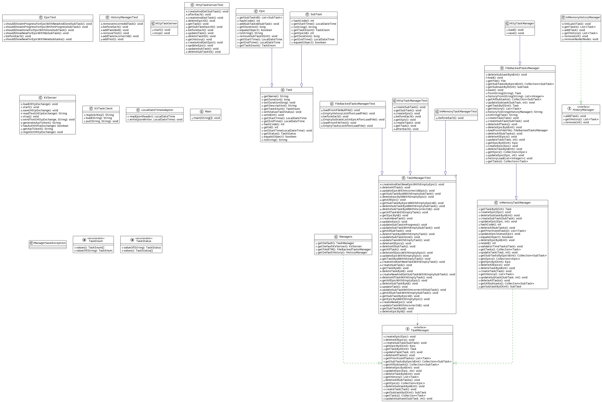

# Kanban
## Менеджер задач.

>Оглавление:
>1) Описание.
>2) Возможности
>3) Диаграмма классов

## Описание

Менеджер задач котрый умеет хранить задачи, хранить историю просмотра, делить задачи на большие и обычные.
Эпичная задача(большая) включает в себя подзадачи. Если все подзадачи в статусе **DONE**, то эпичная задача станет так же **DONE**. Если хоть одна подзадача не выполнена, то эпик остаётся в статусе **IN_PROGRESS**.
Обычные задачи имеют три статуса **NEW** --> **IN_PROGRESS** --> **DOWN**.

## Возможности

>### Хранение истории просмотра задач

Менеджер запоминает какие задачи вызывались.

>### Диаграмма классов

